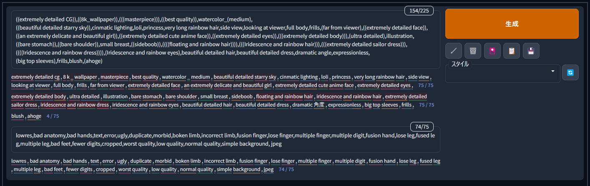
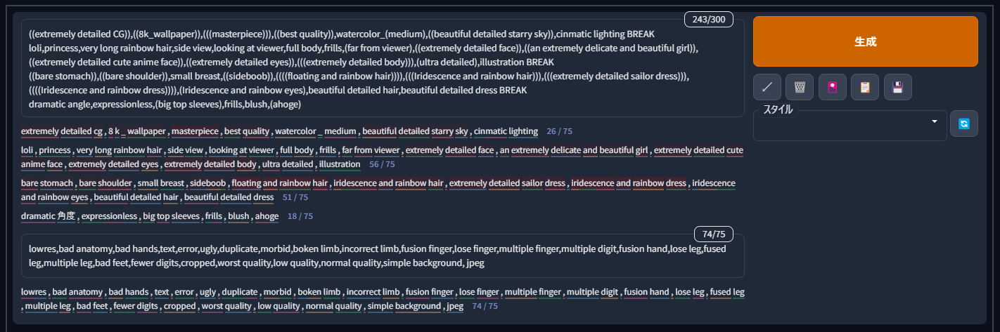
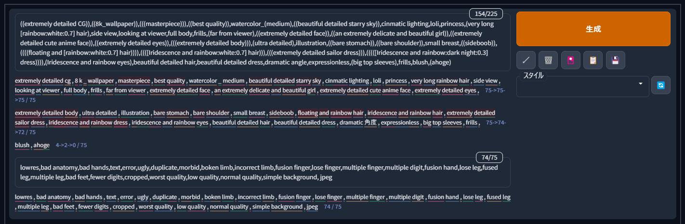
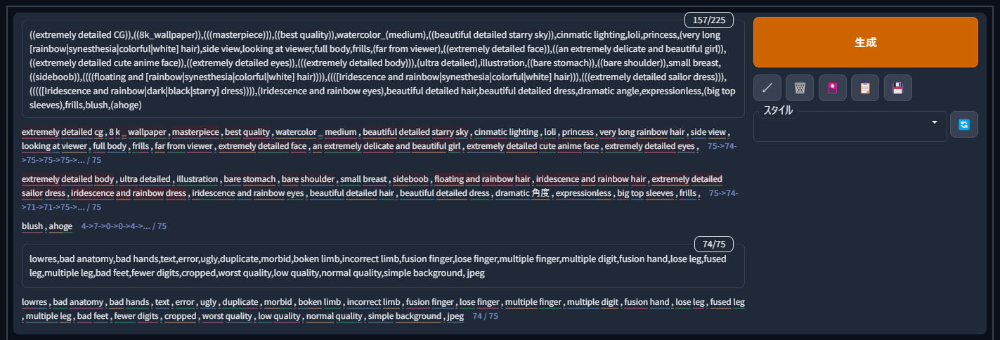
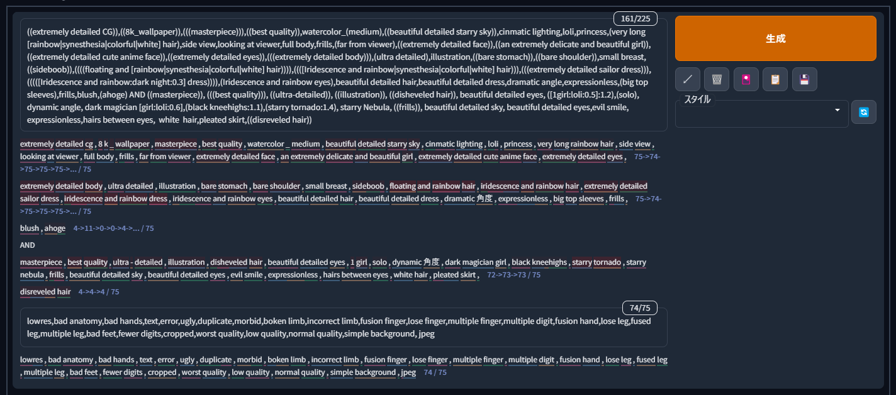

# Interactive Tokenizer Extension for AUTOMATIC1111's Stable Diffusion web UI 
## Japanese
### 機能の説明
プロンプト入力中に以下の情報を確認できます。  
※ネガティブプロンプトでも同様

- Clipが文字列をどう区切って認識しているか
  - 下線で色分け
- 各単語のトークンID
  - 単語にマウスオーバーすると表示
- [強調](https://github.com/AUTOMATIC1111/stable-diffusion-webui/wiki/Features#attentionemphasis)の強さ
  - 単語の背景色
  - 1.0より強ければ強いほど赤、1.0より弱ければ弱いほど青に変化
- チャンク(75トークンの区切り)がどこで区切られているか
  - チャンク毎に改行
- チャンク毎のトークン数
  - [BREAK記法](https://github.com/AUTOMATIC1111/stable-diffusion-webui/wiki/Features#break-keyword)を使っている場合は必ずしも1チャンク75トークンにならないため
  - 各チャンクの後に「<トークン数> / 75」のフォーマットで表記
- 各Stepで変化するプロンプトのトークン数の推移
  - プロンプトがStepによって変化する場合、トークン数の表示を以下のように変更
  - <変化前のトークン数> -> <変化後のトークン数> / 75
  - 変化の回数によって数珠つなぎに増えるが、コンパクトにするため5回目以降は省略
  - 以下の記法を使用していると表示される
    - [Prompt editing](https://github.com/AUTOMATIC1111/stable-diffusion-webui/wiki/Features#prompt-editing)
    - [Alternating Words](https://github.com/AUTOMATIC1111/stable-diffusion-webui/wiki/Features#alternating-words)

### サンプル
プロンプトは[元素法典](https://docs.qq.com/doc/DWHl3am5Zb05QbGVs)のもの一部改変して使用

強調のみ

BREAK記法

AND記法

Prompt editing

Alternating Words

AND記法・Prompt editing・Alternating Words

## English
In order, above images show: emphasis only, BREAK and AND notation, Prompt editing, Alternating Words and an image with all three.

### Functional Description
The following information is shown while entering the prompt/negative prompt:

- How Clip delimits and recognizes strings
  - Color coding with underlines
- Token ID for each word
  - Display when hovering over a word
- Strength of [emphasis](https://github.com/AUTOMATIC1111/stable-diffusion-webui/wiki/Features#attentionemphasis)
  - word background color
  - Stronger than 1.0 turns red, weaker than 1.0 turns blue
- where chunks (75 token delimiters) are separated
  - line break for each chunk
- number of tokens per chunk
  - When using [BREAK keyword] (https://github.com/AUTOMATIC1111/stable-diffusion-webui/wiki/Features#break-keyword), it is not always 1 chunk 75 tokens
  - After each chunk in the format "<number of tokens> / 75"
- Changes in the number of prompt tokens that change at each step
  - If the prompt changes by Step, change the display of the number of tokens as follows.
  - <Number of tokens before change> -> <Number of tokens after change> / 75
  - It increases in a string depending on the number of changes, but for the sake of compactness, the 5th and subsequent times are omitted
  - It is displayed when using the following notation
     - [Prompt editing](https://github.com/AUTOMATIC1111/stable-diffusion-webui/wiki/Features#prompt-editing)
    - [Alternating Words](https://github.com/AUTOMATIC1111/stable-diffusion-webui/wiki/Features#alternating-words)

### sample
Prompts are used with some modifications from [Code of Elements](https://docs.qq.com/doc/DWHl3am5Zb05QbGVs)
